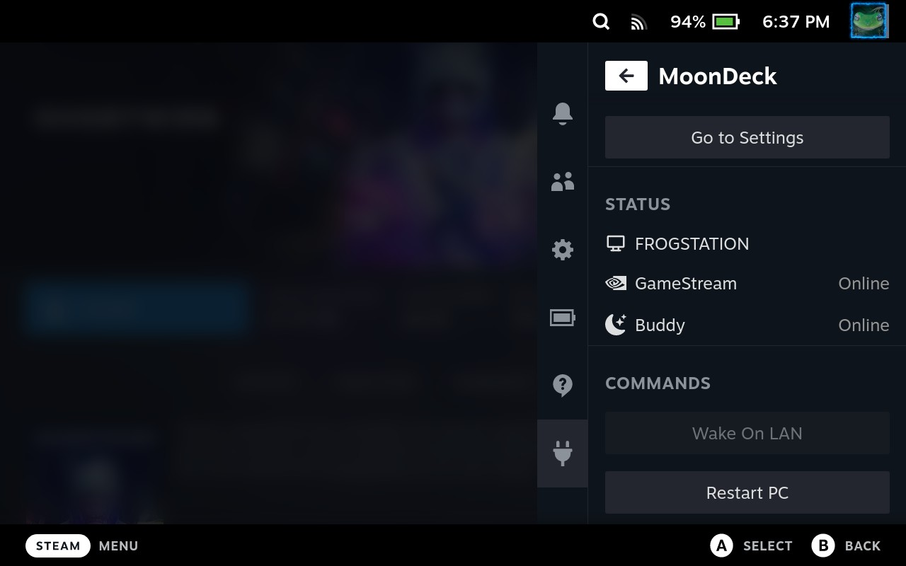

# MoonDeck  

A plugin that lets you play any of your Steam games via Moonlight without needing to add them to Sunshine first, providing a similar experience to GeForce GameStream or Steam Remote Play.

## What is it really?

MoonDeck is an automation tool that will simplify launching your Steam games via the Moonlight client for streaming.

It requires an additional lightweight app to be installed on the host PC - [MoonDeck Buddy](https://github.com/FrogTheFrog/moondeck-buddy). Additional one-time setup instructions can be found within the settings page of the plugin itself.

## ARM64 support (experimental)

The same plugin package also runs on aarch64 Linux handhelds with Decky Loader, such as the AYN Odin 2 Portal running [Armada OS](https://github.com/armada-os/armada). No extra configuration is needed. Install the aarch64 build of the Moonlight flatpak; MoonDeck starts the flatpak for the host architecture.

Known limitations:

* Moonlight's flatpak has no working hardware video decoding on Adreno GPUs, so it decodes on the CPU. If the stream stutters, lower the resolution or bitrate, or set **Video codec** to H.264 in MoonDeck -> Moonlight settings -> General.
* Linked-display features don't work, because the ARM Steam client lacks `SteamClient.System.DisplayManager`. The related errors in the frontend log are harmless.

## Building

To build and deploy the plugin package first copy `.env.example` to `.env` and update any relevant settings. Then either:

* Run `pnpm` commands `pnpm run setup` and `pnpm run build:plugin` and `pnpm run deploy`.
* Run VSCode tasks Ctrl+Shift+P or Cmd+Shift+P and run: `Tasks: Run Task` and choose the task to run.

### Python dependencies

Bundled Python packages live in `defaults/python/externals` and are x86_64 builds. All of them except `psutil` fall back to pure Python on other architectures, so `psutil` also has an aarch64 build in `defaults/python/externals-aarch64`, which the plugin loads first on aarch64.

When bumping versions in `defaults/python/requirements.txt`, update `defaults/python/requirements-aarch64.txt` to match and run `scripts/update-arch-externals.sh`. CI checks that the versions match and that every bundled package imports on both x86_64 and aarch64 (`scripts/check-externals.py`).

## Internal data

This plugin stores data in the following directories:

* Settings - `/home/$USER/.config/moondeck/settings.json`
* Backend logs - `/tmp/moondeck.log`
* Runner logs - `/tmp/moondeck-runner.log`
* Moonlight logs - `/tmp/moondeck-runner-moonlight.log`

Additional frontend logs are written to the `web console`.

## License

This is licensed under GNU GPLv3.
